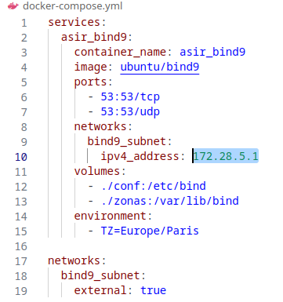
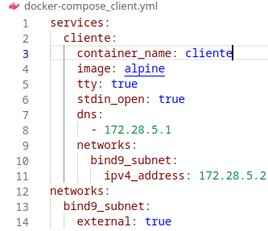
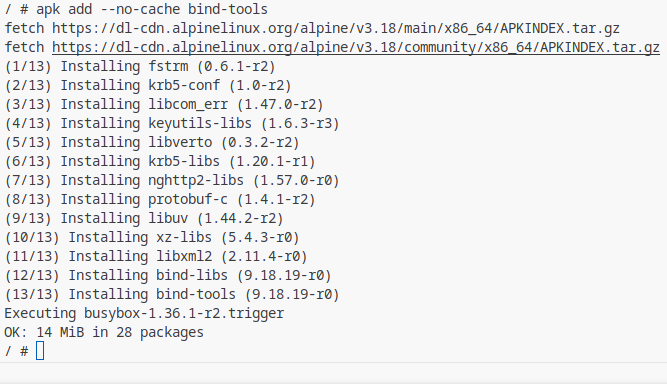
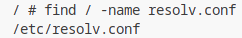
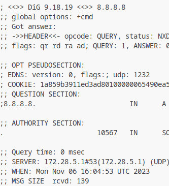

# Configuracion cliente + servidor DNS

## Primero configuramos el docker-compose.yml de manera que cree el servidor DNS y un cliente

#
### Una vez que cliente y servidor estén en funcionamiento accedemos al cliente y descargamos bind-tools para hacer las comprobaciones

#
### Buscamos y modificamos el archivo resolv.conf en el cliente

#
### Y por ultimo comprobamos con dig que la nueva dirección nos resuelva correctamente

