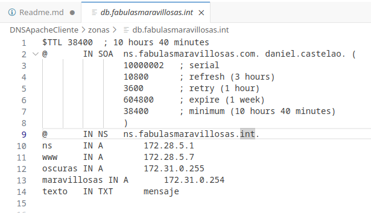

## 1.
### Creo un documento docker .yml en el que creo un contenedor con servicio dns y otro contenedor con servicio de apache ambos con ip fija

## 2.
### Creo los dominios fabulasoscuras y fabulasmaravillosas

