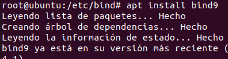
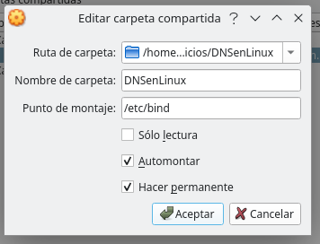
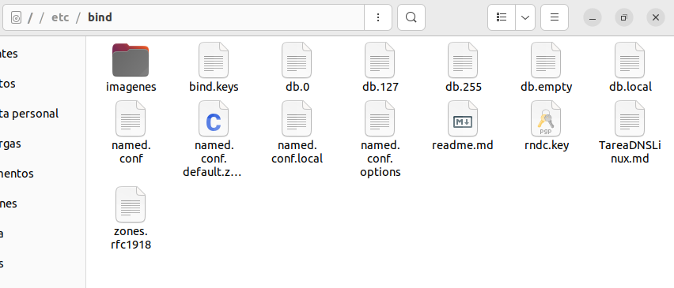
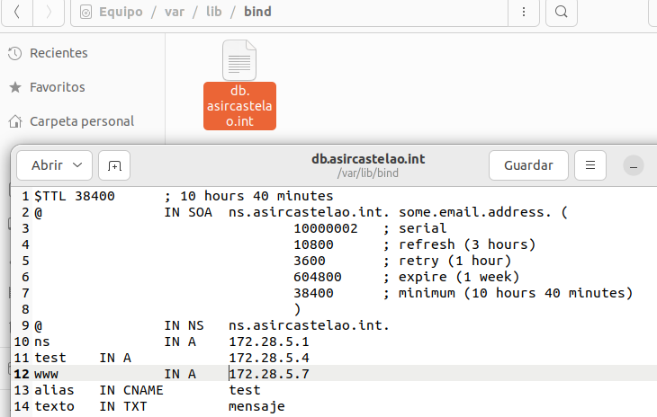
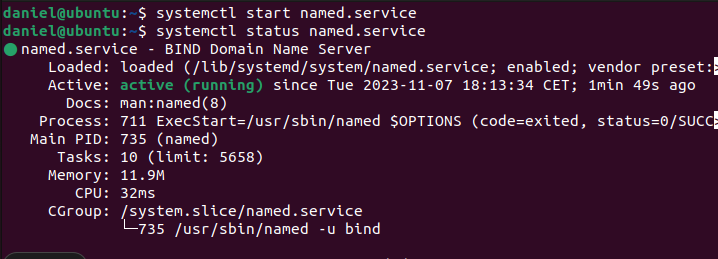
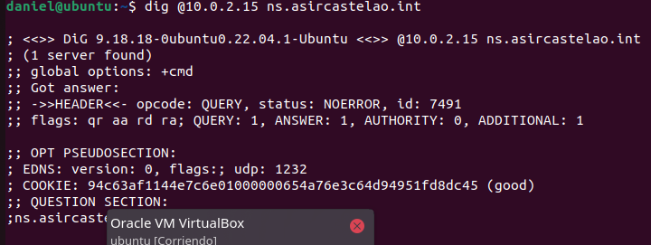
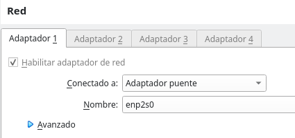
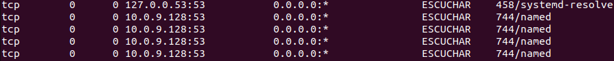
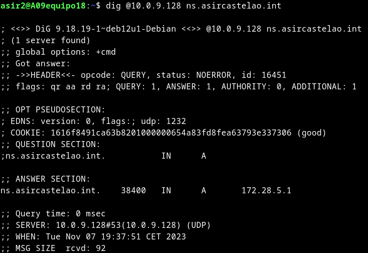

## 1.Primero instalo el ubuntu en una maquina virtual
## 2. Instalar el bind en ubuntu

## 3. Creo una carpeta compartida para para pasar las configuraciones

## 4.Configuro la carpeta /etc/bind para pasarle la configuracion previamente configurada con docker

## 5.Configura las zonas en la carpera /var/lib/bind

## 6.Enciendo el servicio de bind

## 7.Miro a que ip tengo que hacer el ping con netstat -putan

## 8.Compruebo con dig que todo funciona correctamente

## 9.Cambio la configuracion de ethernet a bridge,compruebo la ip de la puerta de bind y intento hacer consultas desde el anfitrion al bind de la maquina virtual

