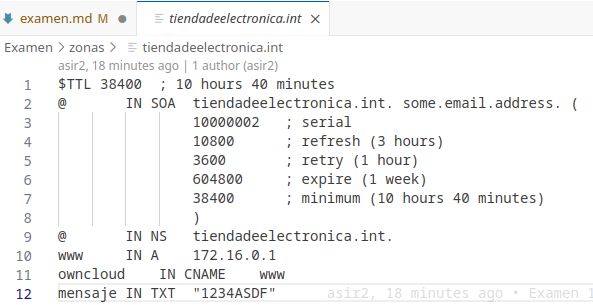
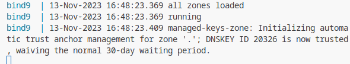
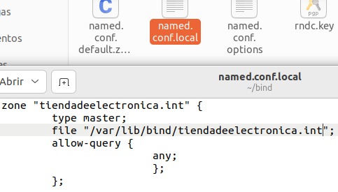
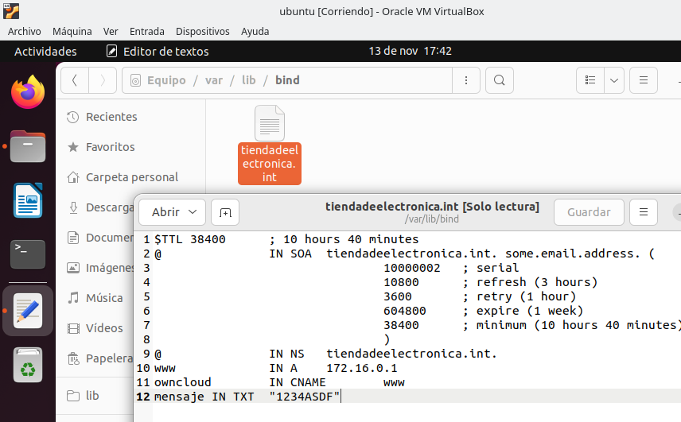
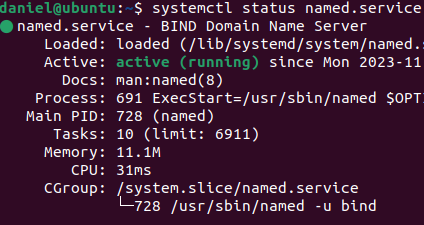

    1.Explica métodos para 'abrir' una consola/shell a un contenedor que se está ejecutando
   
    Se puede acceder con ssh('nombre_user'@'dir_ip_host').

    Haciendo click derecho en el contenedor y usar la opción attach shell.

    En la consola donde tambien podemos usar (docker exec -it nombrecontenedor /bin/bash) y para ver los contenedores docker ps -a

    2.En el contenedor anterior con que opciones tiene que haber sido arrancado para poder interactuar con las entradas y salidas del contenedor
   
    El doker tiene que contener estas opciones tty: true y stdin_open: true

    3.¿Cómo sería un fichero docker-compose para que dos contenedores se comuniquen entre si en una red solo de ellos?
   
    Lo primero seria crear la red,despues para crear los dos contenedores en la misma red,en el docker-compose.yml de cada contenedor asignamos una ip de la red creada

    4.¿Qué hay que añadir al fichero anterior para que un contenedor tenga la IP fija?

    ipv4_addresss: "direccion_ip"
    
    5.¿Que comando de consola puedo usar para saber las ips de los contenedores anteriores? Filtra todo lo que puedas la salida.

    netstat -putan

    6.¿Cual es la funcionalidad del apartado "ports" en docker compose?

    Asignar al contenedor el puerto que definido en el docker
    
    7.¿Para que sirve el registro CNAME? Pon un ejemplo

    Se usa para crear un alias. 
    ns.domino.com. in cname www.dominospizza.com.
    
    8.¿Como puedo hacer para que la configuración de un contenedor DNS no se borre si creo otro contenedor?

    Haciendo una copia de seguridad antes de crear el nuevo contenedor.
#    
    9.Añade una zona tiendadeelectronica.int en tu docker DNS que tenga
        www a la IP 172.16.0.1
        owncloud sea un CNAME de www
        un registro de texto con el contenido "1234ASDF"
        Comprueba que todo funciona con el comando "dig"
        Muestra en los logs que el servicio arranca correctamente

#
    10.Realiza el apartado 9 en la máquina virtual con DNS

Creo la zona

Modifico los registros

Servicio en funcionamiento

