# Tarea DNS
### Primero hay que crear el docker compose y los archivos de configuracion que ves a continuacion:

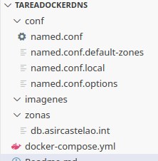

### Para empezar vamos a configurar:
## -docker-compose.yml
A continuacion imagen de un archivo de docker-compose.yml 

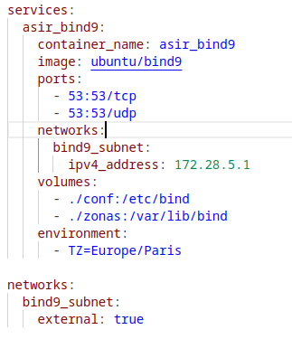
##
### Una vez tengamos el .yml con los servicios que necesitemos tenemos que configurar los archivos que están el la carpeta conf

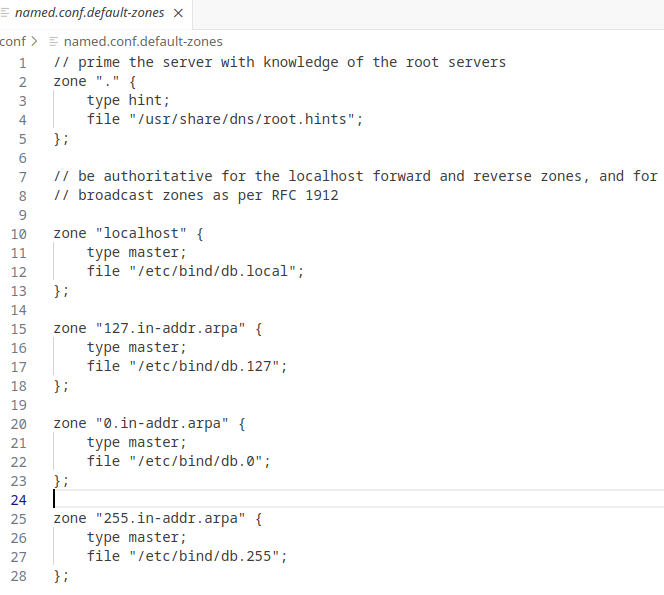

##### Estas son las zonas por defecto

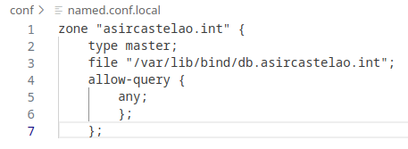

#### Esta es la zona que voy a crear

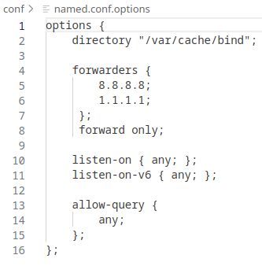

#### Esta es la configuracion del servidor DNS

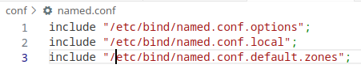

#### Y ahora seleccionamos que archivos usamos para la configuración de nuestro servidor DNS

#
### Creamos la carpeta lib que se usa en el archivo de configuración

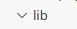
##
### Creamos la carpeta zonas y la configuramos

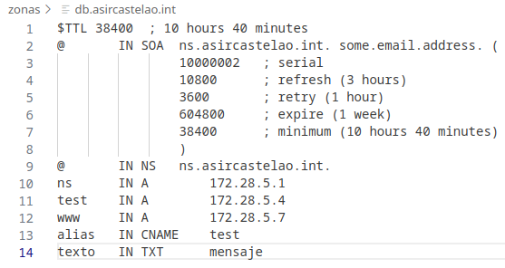
##
### Y ahora por ultimo encendemos nuestro servidor DNS

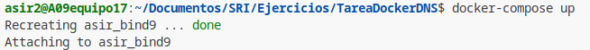
##
### Docker compose en funcionamiento

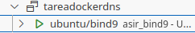

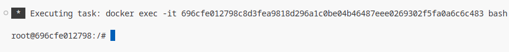

